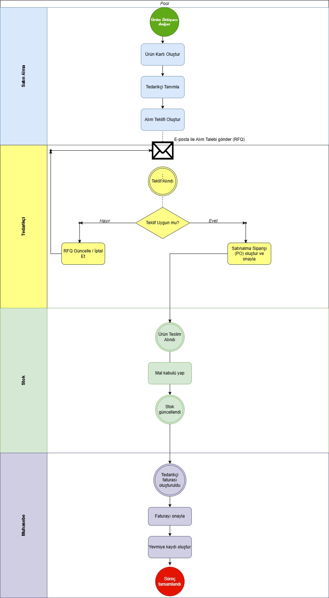

# Business-Analyst-Portfolio-requirements-docs-sample-projects
İş Analisti Portföyü – Gereksinim dokümanı, süreç akışı, veri analizi örnekleri, örnek projeler içermektedir.
Her proje, **Gereksinim Dokümanı (BR/FR/NFR)**, **Süreç Akış Diyagramı (BPMN)** ve ilgili ekler ile birlikte sunulmuştur. 

## 📂 Projeler     


## 📌 Proje 1: Kredi Değerlendirme Modülü – Dijital Dönüşüm

**Amaç:**  
Ticari müşterilerin kredi değerlendirmelerinde kullanılan manuel süreçlerin dijital dönüşümünü sağlamak.  
Bu modül, mali tabloların OCR ile sisteme alınması, finansal rasyoların otomatik hesaplanması, risk puanı üretilmesi (1–10),  
ve kredi politikaları üzerinden karar verilmesi adımlarını kapsamaktadır. Ayrıca Tapu & TSG entegrasyonlarını içerir.  

**Kapsam:**  
- Onaylı mali tabloların taranarak yüklenmesi ve OCR ile okunması  
- Finansal rasyoların otomatik hesaplanması (Borç/Özsermaye, Cari Oran, Likidite Oranı, Kârlılık, Net İşletme Sermayesi)  
- Risk puanı hesaplama ve politika motoru üzerinden karar süreci  
- Tapu ve Ticaret Sicil Gazetesi entegrasyonları  
- Raporlama ve loglama mekanizmaları  
- Yetkili revizyon süreci (maker-checker prensibi)  

📄 **Dokümanlar:**  
- [Gereksinim Dokümanı (BR/FR/NFR)](./Kredi_Degerlendirme_Modulu.docx)
- [Gereksinim Dokümanı (BR/FR/NFR)](./Kredi_Degerlendirme_Modulu.pdf)
- [BPMN Süreç Akışı](./BPMN.png)  
- [ERD / Veri Modeli](./ERD.png)  

👤 **Rolüm:** İş Analisti (dokümanları tek başıma hazırladım)

---

## 📌 Proje 2: Kredi Başvuruları Veri Analizi ve Raporlama

**Proje Özeti**: Ticari kredi başvurularının durumunu analiz etmek ve raporlamak amacıyla hazırladığım mini proje.  
SQL Server üzerinde Customers, Applications ve Payments tablolarını oluşturdum, test verileri ile sorgular çalıştırdım.  
Onay/Ret oranları, bölgelere göre başvuru dağılımları ve aylık trendler analiz edilerek Excel/Power BI üzerinde görselleştirildi.  
Proje, iş analizi bakış açısıyla veri modelleme, gereksinim belirleme ve raporlama becerilerimi göstermektedir.

## İçerikler
- [Gereksinim Özeti](Kredi_Basvurulari_Analizi_Gereksinim_Ozeti.pdf)

### 📝 SQL Analiz Sorguları
[SQL Analiz Sorguları](analysis_queries.sql)  
Kredi başvurularının:
- Onay/Ret oranları
- Bölgelere göre dağılımı
- Geciken ödeme detayları  

**Not:** Bu SQL sorguları demo bir şemaya göre hazırlanmıştır. Portföy amacıyla paylaşıldığından, birebir çalıştırılabilir olmayabilir.  
Amaç, veri analizi ve iş kurallarını kontrol etme yaklaşımını göstermektir.

### ✅ Test Senaryoları
[Test Senaryolarını Görüntüle](test_cases/test_cases.md)  
SQL kullanılarak iş kurallarının doğrulanması.  
**Not:** Bu test senaryoları demo şemaya göre hazırlanmıştır. Portföy amacıyla paylaşıldığından birebir çalıştırılabilir olmayabilir.  

### 📊 Raporlar
SQL çıktılarının Excel/Power BI ile görselleştirilmesi.  
👉 [reports klasörüne göz atın](reports/)

## Kullanılan Teknolojiler
- SQL (MSSQL/PostgreSQL uyumlu sorgular)
- Excel / Power BI (raporlama için)

👤 **Rolüm:** İş Analisti (dokümanları tek başıma hazırladım)

---
## 📌 Proje 3: Kredi Yaşam Döngüsü Mini CRM Projesi - CreditFlow CRM Demo Project

**Proje Özeti**: Bu proje, müşteri başvurularının, finansal inceleme ve destek taleplerinin uçtan uca yönetimini sağlayan mini bir CRM sistemidir.
-Proje kapsamında:  
- **Müşteri başvuruları (Applications)**  
- **Finansal incelemeler (Reviews)**  
- **Müşteri destek talepleri (Tickets)**  
- **Müşteri bilgileri (Customers)**  
yönetilmekte ve aynı zamanda SQL tabanlı veri analizi yapılmaktadır.  

Proje, **SQL** ve **CRM (HubSpot)** arasında köprü görevi görür:  
Veritabanındaki başvuru ve müşteri kayıtları, HubSpot üzerinde satış (Sales) ve destek (Service) süreçleri olarak modellenmiştir.  

Gerçek bir iş analisti veya veri analisti projesi gibi kurgulanmış olup,  
**iş süreçleri – veri modeli – KPI raporlaması – CRM pipeline entegrasyonu** bileşenlerini içermektedir.

## ⚙️ Kullanılan Teknolojiler

| Teknoloji | Amaç | Dosya / Link |
|------------|------|--------------|
| **MS SQL Server (T-SQL)** | Veri tabanı, KPI hesaplamaları | [📄 KPI Queries](Kpi_queries_report.sql) · [🧩 Schema](T-sql_schema.sql) |
| **HubSpot CRM (Free Demo)** | Satış ve müşteri destek süreçleri | [📊 Pipeline Stages](hubspot_pipeline_stages.png) · [💼 Deals Pipeline](hubspot_credit_pipeline_filled.png) · [🎫 Tickets Demo](hubspot_tickets_demo.png) |
| **Draw.io (ERD)** | Veri modeli diyagramı | [🗺️ ERD Diagram](crm_erd_diagram.drawio.jpg) |


## 🧩 **Entity Relationship Diagram (ERD)**
[🗺️ ERD Diyagramını Görüntüle](crm_erd_diagram.drawio.jpg)

Bu diyagram, mini CRM sistemindeki veri modelini ve tablolar arası ilişkileri gösterir.  
Toplamda 4 ana tablo vardır: **Customers, Applications, Reviews, Tickets**

📊 **İlişkiler:**
- 1 Customer → N Applications  
- 1 Application → N Reviews  
- 1 Customer → N Tickets  
- 1 Application → N Tickets  


## 🗃️ **Veritabanı (T-SQL) Yapısı**

**1️⃣ Ana tablolar:**
- `customers`
- `applications`
- `reviews`
- `tickets`

**2️⃣ KPI Raporlama

KPI sorguları (Kpi_queries_report.sql) dosyasında yer almaktadır.  
 KPI senaryoları:
-Ortalama değerlendirme süresi (gün)
-Ret oranı (%)
-SLA içinde kapanan ticket oranı (%)

---

## 📌 Proje 4: ERP Süreç Akışı – Satın Alma & Finans Modülü Analizi (Odoo Demo)

### 🌟 Proje Amacı

Bu proje, Odoo ERP sistemi üzerinde **Satın Alma (Purchase)** ve **Finans (Accounting)** modüllerinin entegrasyonunu analiz etmek amacıyla hazırlanmıştır.
Süreç, bir ürünün tedarik edilmesinden faturanın muhasebeleştirilmesine kadar olan tüm aşamaları örnek ekran görüntüleriyle göstermektedir.


### ⚙️ Kullanılan Modüller

* **Satınalma (Purchase)**
* **Stok (Inventory)**
* **Muhasebe (Accounting)**
* **Ürün Yönetimi (Product Management)**


## 🧭 BPMN Process Flow – Purchase to Pay (P2P)

Bu BPMN diyagramı, Odoo ERP sistemi üzerinde yürütülen satın alma sürecini (Purchase to Pay) göstermektedir.  
Süreç; ürün ihtiyacının doğmasından, faturanın muhasebe kayıtlarına işlenmesine kadar olan tüm adımları içerir.



### 🔁 Süreç Akışı

1. **Ürün Kartı Oluşturma**

   * Laptop Lenovo Thinkbook ürünü oluşturuldu.
   * Satış, satınalma ve stok takibi aktif hale getirildi.
   [📁 01_Product.png](01_Product.png)
     📝 *“Ürün ERP sistemine tanımlandı ve satış-satınalma süreçlerine açıldı.”*

2. **Tedarikçi Tanımlama**

   * Tedarikçi olarak *Teknomarket A.Ş.* eklendi.
     [📁 02_Vendor_Creation.png](02_Vendor_Creation.png)
     📝 *“Satınalma sürecinde kullanılacak tedarikçi bilgisi oluşturuldu.”*

3. **Alım Teklif Talebi (RFQ) Oluşturma**

   * Ürün için teklif talebi (P00001) oluşturuldu ve e-posta ile gönderildi.
      [📁 03_RFQ_Creation.png](03_RFQ_Creation.png)
     📝 *“Tedarikçiye fiyat teklifi isteği gönderildi.”*

4. **Satınalma Siparişi (Purchase Order) Onayı**

   * Teklif kabul edilerek sipariş onaylandı.
      [📁 04_Purchase_Confirmed.png](04_Purchase_Confirmed.png)
     📝 *“Teklif onaylandı, satınalma siparişi oluşturuldu.”*

5. **Mal Kabul (Goods Receipt)**

   * Tedarikçiden gelen ürün teslim alındı, stoklara işlendi.
      [📁 05_Goods_Receipt_Done.png](05_Goods_Receipt_Done.png)
     📝 *“Satınalma emri sonucu tedarikçiden gelen ürün başarıyla teslim alındı.”*

6. **Tedarikçi Faturası (Vendor Bill)**

   * Satınalma siparişine bağlı olarak tedarikçi faturasi oluşturuldu.
  [📁 06_billing.png](06_billing.png)
     📝 *“Tedarikçi faturasi oluşturulmuş, ürün maliyetleri finans modülüne aktarılmıştır.”*

7. **Yevmiye Kayıtları (Journal Entries)**

   * Fatura onaylandığında otomatik muhasebe kaydı oluşturuldu.
      [📁 07_YevmiyeKaydi.png](07_PYevmiyeKaydi.png)
     📝 *“150000 Malzeme, 191000 İndirilecek KDV, 320000 Satıcılar hesaplarına otomatik kayıt yapıldı.”*


### 📊 Süreç Sonucu

* Satınalma süreci başarıyla tamamlanmış,
* Stok miktarı güncellenmiş,
* Muhasebe modülüne otomatik yevmiye kaydı yansımıştır.

Bu sayede **Satınalma – Stok – Muhasebe** modülleri arasındaki **entegrasyon doğrulanmıştır.**


### 💡 Kazanımlar

Bu proje kapsamında:

* ERP süreç akışı oluşturma ve analiz etme,
* Odoo üzerinde modüller arası veri entegrasyonu gözlemleme,
* Satınalma sürecinin finansal etkilerini inceleme,
* İş analizi dokümantasyonu hazırlama
  yetkinlikleri geliştirilmiştir.

---

## 📌 Proje 5: Odoo Demo Mini Case Study — ABC Mobile Ticaret
*(Seri Numarası Takibi • Çoklu Para Birimi • Ürün Varyant Yönetimi • Fiyat Listeleri)*

## Proje Özeti
Bu çalışma, Odoo’nun demo ortamında iş senaryosunu mini bir case study yaklaşımıyla ele alarak kurgulamak ve doğrulamak amacıyla hazırlanmıştır.
Amaç görsel olarak kapsamlı bir e-ticaret sitesi tasarlamak değil; senaryodaki gereksinimleri parçalara ayırıp uygun modülleri seçerek Odoo üzerinde konfigüre etmek ve küçük testlerle doğrulamaktır. Bu nedenle tema/görsel düzen tarafına sınırlı odaklanılmıştır.
   Not: Bu çalışmanın senaryosu tarafıma ait değildir. Ancak senaryo üzerinden Odoo demo ortamında yapılan konfigürasyon çalışmaları, ekran görüntüleri ve dökümanların tamamı tarafıma aittir. Bu çalışma, ticari amaçlı değildir. Senaryonun içeriği özetlenmiş ve kişisel veri gizliliği kapsamında kurum/kişi bilgileri paylaşılmamıştır.

## Senaryo
Cep telefonu ticareti yapan bir işletme için Odoo demo ortamında örnek bir kurgu oluşturuldu. İşletmenin temel ihtiyaçları:

- E-ticaret sitesi kurgusu,
- Ürünlerin **seri numarasıyla** izlenmesi,
- **TRY (TL), USD ve GBP** para birimlerinin sistemde aktif olması,
- Standart ürünlerin yanında 1 adet **özel ürünün** varyant yapısıyla yönetilmesi,
- Web sitesinde **giriş yapan kullanıcı** ile **misafir kullanıcı** için TL bazında **farklı fiyat listesi** gösterilmesi.

### Özel Ürün Varyant Kurgusu
- **Renk:** Yeşil, Mavi, Beyaz  
- **Model:** 15, 16, 17  
- **Kısıtlar:**  
  - Model 15’te **Mavi yok**  
  - Model 17’de **Beyaz yok**

## Yaklaşım
Senaryoyu 6 gereksinime böldüm [docs/Gereksinim_Dokumani.md](docs/Gereksinim_Dokumani.md) , ilgili modülleri seçip Odoo’da konfigüre ettim ve küçük testlerle doğruladım. [docs/Test_Cases.md](docs/Test_Cases.md)

## Kullanılan Modüller
- Web Sitesi / e-Ticaret
- Stok
- Satış
- Muhasebe (para birimleri)
- CRM / Kişiler (portal/üye kurgusu)

## Dokümanlar
Bu proje için detaylı içerikler doküman olarak tutulmuştur:
- **Gereksinim Dokümanı:** [docs/Gereksinim_Dokumani.md](docs/Gereksinim_Dokumani.md)
- **Test Caseler:** [docs/Test_Cases.md](docs/Test_Cases.md)


```

---

### ✨ Hazırlayan

👤 **Begüm Aslıhan Odabaşı**
📍 *ERP & CRM Business Analyst (Transitioning)*
🔗 [LinkedIn Profilim](https://www.linkedin.com/in/begum-aslihan-odabasi)
🔗 [GitHub Portfolio](https://github.com/begumodabasi)

## 🌟 Hakkımda  
Bilgisayar Mühendisliği mezunuyum ve 10+ yıl süren bankacılık/finans deneyimimin ardından  
teknoloji odaklı analist rollerine (Business Analyst & Data Analyst) geçiş yapıyorum.  

- Bankacılıkta süreç analizi, finansal raporlama ve kredi risk değerlendirme alanlarında deneyimliyim.  
- Şu anda CRM/ERP sistemleri, SQL, Python ve Power BI üzerine uygulamalı projeler geliştiriyorum.  
- Uluslararası İş Analizi Metodolojisi, Agile Proje Yönetimi, Yazılım Test Uzmanlığı ve SQL sertifikalarına sahibim.  
- SAP ERP, UiPath ve veri analitiği eğitimlerim devam etmektedir.   
---

🔗 Contact

LinkedIn: https://www.linkedin.com/in/begum-aslihan-odabasi

Email: begumasli.ozyalcin@gmail.com

📌 Not: Buradaki dokümanlar eğitim amaçlıdır, gizli kurumsal bilgi içermez.  
