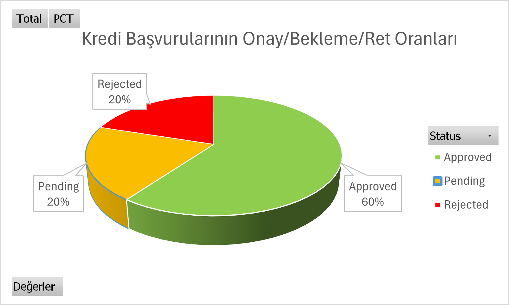
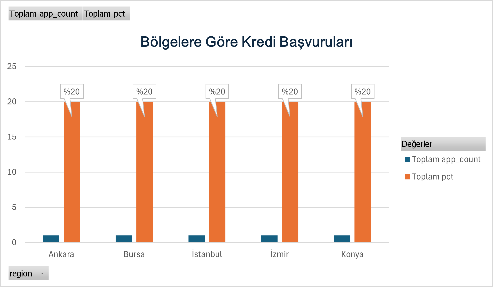
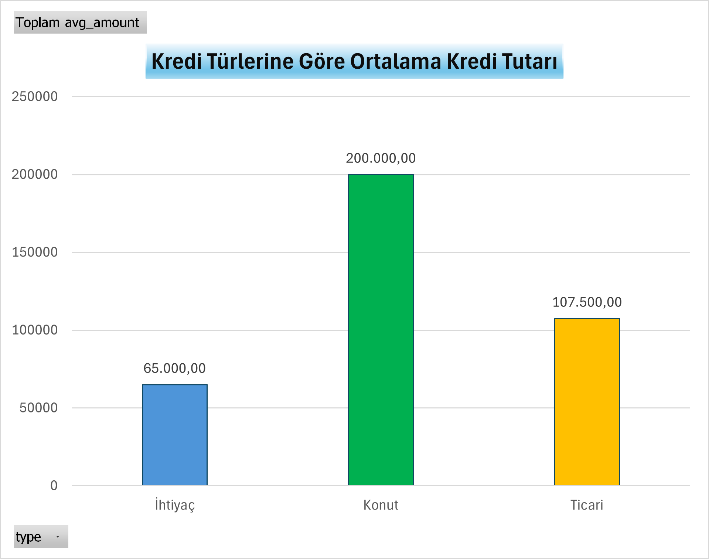
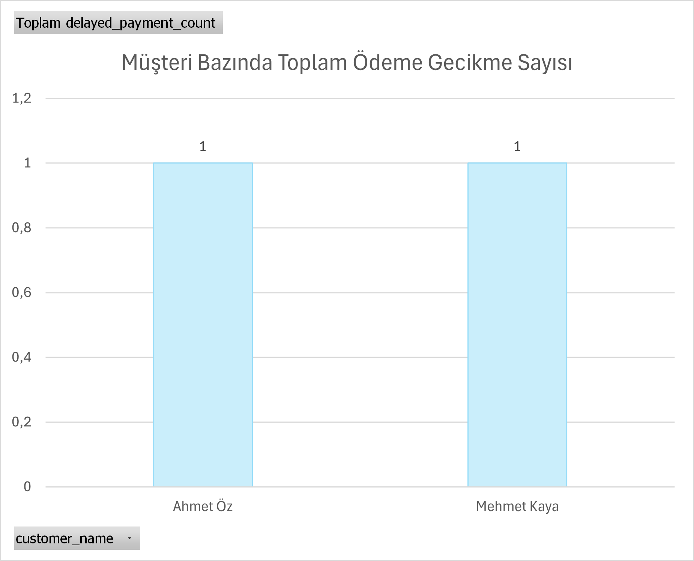

# Business-Analyst-Portfolio-requirements-docs-sample-projects
İş Analisti Portföyü – Gereksinim dokümanı, süreç akışı, veri analizi örnekleri, örnek projeler içermektedir.
Her proje, **Gereksinim Dokümanı (BR/FR/NFR)**, **Süreç Akış Diyagramı (BPMN)** ve ilgili ekler ile birlikte sunulmuştur. 

## 📂 Projeler     

## 📌 Proje 1: Kredi Değerlendirme Modülü – Dijital Dönüşüm

**Amaç:**  
Ticari müşterilerin kredi değerlendirmelerinde kullanılan manuel süreçlerin dijital dönüşümünü sağlamak.  
Bu modül, mali tabloların OCR ile sisteme alınması, finansal rasyoların otomatik hesaplanması, risk puanı üretilmesi (1–10),  
ve kredi politikaları üzerinden karar verilmesi adımlarını kapsamaktadır. Ayrıca Tapu & TSG entegrasyonlarını içerir.  

**Kapsam:**  
- Onaylı mali tabloların taranarak yüklenmesi ve OCR ile okunması  
- Finansal rasyoların otomatik hesaplanması (Borç/Özsermaye, Cari Oran, Likidite Oranı, Kârlılık, Net İşletme Sermayesi)  
- Risk puanı hesaplama ve politika motoru üzerinden karar süreci  
- Tapu ve Ticaret Sicil Gazetesi entegrasyonları  
- Raporlama ve loglama mekanizmaları  
- Yetkili revizyon süreci (maker-checker prensibi)  

📄 **Dokümanlar:**  
- [Gereksinim Dokümanı (BR/FR/NFR)](./Kredi_Degerlendirme_Modulu.docx)
- [Gereksinim Dokümanı (BR/FR/NFR)](./Kredi_Degerlendirme_Modulu.pdf)
- [BPMN Süreç Akışı](./BPMN.png)  
- [ERD / Veri Modeli](./ERD.png)  

👤 **Rolüm:** İş Analisti (dokümanları tek başıma hazırladım)

---

## 📌 Proje 2: Kredi Başvuruları Veri Analizi ve Raporlama

**Proje Özeti**:Ticari kredi başvurularının durumunu analiz etmek ve raporlamak amacıyla hazırladığım mini proje. 
SQL Server üzerinde Customers, Applications ve Payments tablolarını oluşturdum, test verileri ile sorgular çalıştırdım. 
Onay/Ret oranları, bölgelere göre başvuru dağılımları ve aylık trendler analiz edilerek Excel/Power BI üzerinde görselleştirdim.
Proje, iş analizi bakış açısıyla veri modelleme, gereksinim belirleme ve raporlama becerilerini göstermektedir.
## İçerikler
- [Gereksinim Özeti](Kredi_Basvurulari_Analizi_Gereksinim_Ozeti.pdf)
- ## 📝 SQL Analiz Sorguları
[SQL Analiz Sorguları](analysis_queries.sql)  
Kredi başvurularının;
- Onay/Red oranları
- Bölgelere göre dağılımı
- Geciken ödeme detayları gösterilmiştir.
**Not:** Bu SQL sorguları demo bir şemaya göre hazırlanmıştır. Portföy amacıyla paylaşıldığından, birebir çalıştırılabilir olmayabilir.  
Amaç, veri analizi ve iş kurallarını kontrol etme yaklaşımını göstermektir.

Projede hazırlanan SQL sorgularının çıktıları Excel üzerinde PivotTable ve grafiklerle görselleştirilmiştir.  

### 1️⃣ Onay/Ret Oranı
Kredi başvurularının onay, bekleme ve reddedilme oranlarını göstermektedir.  

---

### 2️⃣ Bölgelere Göre Kredi Başvuruları
Başvuruların farklı bölgelere dağılımını göstermektedir.  

---

### 3️⃣ Kredi Türlerine Göre Ortalama Kredi Tutarı
İhtiyaç, Konut ve Ticari kredi türlerine göre ortalama başvuru tutarları.  

---

### 4️⃣ Müşteri Bazında Ödeme Gecikmeleri
Müşterilerin toplam geciken ödeme sayıları ve detayları.  

- Genel dağılım  
    

- Detaylı tablo görünümü  
  
- **Test Senaryoları**: SQL kullanılarak iş kurallarının doğrulanması.
**Not: Bu test sorguları demo şemaya göre hazırlanmıştır. Portföy amacıyla paylaşıldığından, birebir çalıştırılabilir olmayabilir. Amaç, veri analizi ve iş kurallarını kontrol etme yaklaşımını göstermektir.
- **Raporlar**: SQL çıktılarının Excel/Power BI ile görselleştirilmesi .

## Kullanılan Teknolojiler
- SQL (MSSQL/PostgreSQL uyumlu sorgular)
- Excel / Power BI (raporlama için)
  
👤 **Rolüm:** İş Analisti (dokümanları tek başıma hazırladım)

---

## 🌟 Hakkımda  
- 10+ yıl bankacılık ve finans deneyimi  
- İş analisti/veri analisti rollerine geçiş sürecindeyim  
- Uluslararası İş Analizi Metodolojisi ve Teknikleri, Agile Proje Yönetimi, Yazılım Test Uzmanlığına Giriş ve SQL sertifikalarım bulunmakta olup, Phyton, Power BI, SAP ERP eğitimlerim devam etmektedir.

---
🔗 Contact

LinkedIn: https://www.linkedin.com/in/begum-aslihan-odabasi

Email: begumasli.ozyalcin@gmail.com

📌 Not: Buradaki dokümanlar eğitim amaçlıdır, gizli kurumsal bilgi içermez.  
